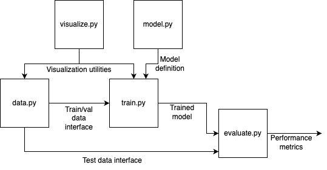

# 🍪 A up-to-date Cookiecutter template for MLOps/Reproducible Data Science

This template is based on the amazing work by [@SkafteNicki](https://github.com/SkafteNicki), with some slight modifications to suit my needs better.

Changes involve:
- Removal of API python and dockerfiles (I dont host stuff in cloud)
- Integration of CookieCutter DataScience v2 quality of life stuff (`config.py` being one of them)
- Added automatic `devcontainer.json` setup with data and models volume mounts (commented-out defaults)
- Simplified Docker workflow: single-stage Dockerfile with optimized layer caching (dependencies cached separately from source code)

## ✋ Requirements to use the template:

<!-- * Python 3.11 or higher -->
* [cookiecutter](https://github.com/cookiecutter/cookiecutter) version 2.4.0 or higher

## 📦 Dependency Management

The template uses [uv](https://docs.astral.sh/uv/) with platform-aware lock files:

```toml
[tool.uv]
environments = [
  "sys_platform == 'linux' and platform_machine == 'aarch64'",
  "sys_platform == 'linux' and platform_machine == 'x86_64'",
  "sys_platform == 'darwin' and platform_machine == 'arm64'",
  "sys_platform == 'darwin' and platform_machine == 'x86_64'",
]
```

This ensures `uv.lock` includes compatible wheels for all platforms. Generate it once on your Mac/Linux:

```bash
uv lock
```

The lock file works for local development and Docker builds — no platform-specific handling needed.

## 🆕 Start a new project

On your local machine run

```bash
cookiecutter https://github.com/nicholasphansen/mlops_template
```

You will be prompted with the following questions:

```txt
    [1/6] repo_name (repo_name):
    [2/6] project_name (project_name):
    [3/6] author_name (Your name (or your organization/company/team)):
    [4/6] description (A short description of the project.):
    [5/6] python_version (3.11):
    [6/6] Select open_source_license
        1 - No license file
        2 - MIT
        3 - BSD-3-Clause
        Choose from [1/2/3] (1):
```

Where you should input starting values for the project. When asked for the repository name when creating the template,
input the same name as when you created the repository. Note that when asked for the project name, you should input
a [valid Python package name](https://peps.python.org/pep-0008/#package-and-module-names). This means that the name
should be all lowercase and only contain letters, numbers and underscores. The project name will be used as the name of
the Python package. This will automatically be validated by the template.

To commit to the remote repository afterwards execute the following series of commands:

```bash
cd <repo_name>
git init
git add .
git commit -m "init cookiecutter project"
git remote add origin https://github.com/<username>/<repo_name>
git push origin master
```

## 🗃️ Repository structure

When the project is created, the repository will have the following structure:

```txt
├── .github/                  # Github actions and dependabot
│   ├── dependabot.yaml
│   └── workflows/
│       └── tests.yaml
├── configs/                  # Configuration files
├── data/                     # Data directory
│   ├── processed
│   └── raw
├── Dockerfile                # Docker container configuration
├── docs/                     # Documentation
│   ├── mkdocs.yml
│   └── source/
│       └── index.md
├── models/                   # Trained models
├── notebooks/                # Jupyter notebooks
├── reports/                  # Reports
│   └── figures/
├── src/                      # Source code
│   ├── project_name/
│   │   ├── __init__.py
│   │   ├── config.py
│   │   ├── data.py
│   │   ├── evaluate.py
│   │   ├── model.py
│   │   ├── train.py
│   │   └── visualize.py
└── tests/                    # Tests
│   ├── __init__.py
│   ├── test_data.py
│   └── test_model.py
├── .gitignore
├── .pre-commit-config.yaml
├── LICENSE
├── pyproject.toml            # Python project file
├── README.md                 # Project README
├── requirements.txt          # Project requirements
├── requirements_dev.txt      # Development requirements
└── tasks.py                  # Project tasks
```

In particular lets explain the structure of the `src` folder as that is arguably the most important part of the
repository. The `src` folder is where the main code of the project is stored. The template divides the code into five
files, shown in the diagram below with their respective connections:



* `data.py`: this file is responsible for everything related to the data. This includes loading, cleaning, and splitting
    the data. If the data needs to be pre-processed then running this file should process raw data in the `data/raw`
    folder and save the processed data in the `data/processed` folder.
* `model.py`: this file contains one or model definitions.
* `train.py`: this file is responsible for training the model. It should import the training/validation data interface
    from `data.py` and the model definition from `model.py`.
* `evaluate.py`: this file is responsible for evaluating the model. It should import the test data interface from
    `data.py` and load the trained model from the `models` folder. Output should be performance metrics of the trained
    model.
* `visualize.py`: this file is responsible for visualizing the data and model. It should import the training/validation/
    test data interface from `data.py` and the trained model from the `models` folder. Output should be visualizations
    of the data and model.

At some point one or more of the files may have grown too large and complicated. At this point it is recommended to
split the file into multiple files and move into a folder of the same name. As an example consider the `model.py`
containing many models. In this case it would be a good idea to refactor into

```txt
src/
└── project_name/
    ├── __init__.py
    ├── models/
    │   ├── __init__.py
    │   ├── model1.py
    │   └── model2.py
    ├── ...
```

## 📋 Available Commands

Once a project is created from the template, you can use the CLI to run various tasks. Use the `cli` command (as defined in `pyproject.toml`) to execute:

```bash
# Preprocess data from data/raw and save to data/processed
cli data [--input-path PATH] [--output-path PATH]

# Train the model
cli train [--features-path PATH] [--labels-path PATH] [--model-path PATH]

# Evaluate the trained model
cli eval [--features-path PATH] [--model-path PATH] [--predictions-path PATH]

# Generate visualizations
cli plots [--input-path PATH] [--output-path PATH]

# Run tests with pytest
cli test

# Format code with ruff
cli format
```

**Examples:**

```bash
# Default behavior - preprocess data from data/raw to data/processed
cli data

# Custom data paths
cli data --input-path ./my_raw_data --output-path ./my_processed_data

# Train with default paths
cli train

# Run tests and format code
cli test
cli format
```

## 📚 The stack

🐍 Python projects using `pyproject.toml`

🔥 Models in [Pytorch](https://pytorch.org/)

📦 Containerized using [Docker](https://www.docker.com/)

📄 Documentation with [Material Mkdocs](https://squidfunk.github.io/mkdocs-material/)

👕 Linting and formatting with [ruff](https://docs.astral.sh/ruff/)

✅ Checking using [pre-commit](https://pre-commit.com/)

🛠️ CI with [GitHub Actions](https://github.com/features/actions)

🤖 Automated dependency updates with [Dependabot](https://github.com/dependabot)

📝 Project tasks using [Typer](https://typer.tiangolo.com/)

and probably more that I have forgotten...

## ❕ License

If you enjoy using the template, please consider giving credit to @SkafteNicki by citing it.
You can use the following BibTeX entry:

```bibtex
@misc{skafte_mlops_template,
    author       = {Nicki Skafte Detlefsen},
    title        = {MLOps template},
    howpublished = {\url{https://github.com/SkafteNicki/mlops_template}},
    year         = {2024}
}
```
